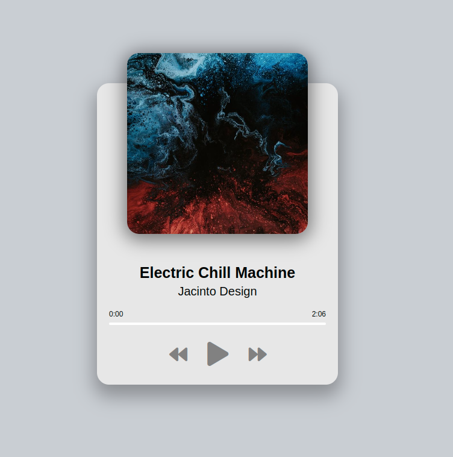

# [LIVE DEMO](https://shcoobz.github.io/music-player/) -> Music Player

## Summary

Music Player provides a simple and intuitive interface for playing music tracks. It features a minimalist design, easy navigation between songs, and a responsive layout for different screen sizes.

The core functionality includes:

- Playing, pausing, and skipping songs.
- Displaying current song information including title, artist, and album art.
- Progress bar to show song playback status and allow seeking.

## Features

### User-Friendly Interface

The Music Player has a clean and simple interface, making it easy for users to control their music playback with minimal interaction.

### Responsive Design

Designed to be responsive, the Music Player looks and works great on devices of all sizes, from desktops to smartphones.

### Progress Tracking

A progress bar shows the current playback status of the song. Users can click or tap on the progress bar to seek to different parts of the song.

### Additional Features

- Display of current song duration and elapsed time.
- Visual feedback when buttons are interacted with.

## Technologies

- HTML5 for structuring the application.
- CSS3 for styling, including Flexbox for layout and transitions for animations.
- Vanilla JavaScript for interactivity and controlling the audio element.
- Google Fonts for custom typography.
- Font Awesome for icons.

---

_Note: This document provides an overview of Music Player. For detailed instructions and more information, please refer to the source code documentation._
